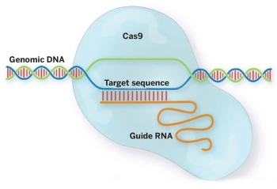

# Neptune Computational Biology - CRISPR gRNA search tool for Sp.purpuratus 

# Title of my project
# CRISPR gRNA seq search

## Introduction and Goals

The goal is to create a tool for gRNA search in purple sea urchin: 

The program features include: library of sea urchin genomic scaffold from which you can download a desired sequence for PAM sequence search.

The tool marks the start and end sites of PAM sequence, within the desired sequence. It does for both forward and reverse strand. It also isolates 20 nt streach of nt for gRNA sequence and generate both gRNA and PAM sequence into fasta file.

Online blastq tool was integrated to do search within blastn database. It allows search for single gRNA query at a time.

## Methods

The integration of genomic data and blastq search tool was done with Biopython 1.67. The scripts used were donwloaded from Biopython Tutorial and Cookbook (http://biopython.org/DIST/docs/tutorial/Tutorial.html#htoc91)

Codes to invoke specific fuctions from the NCBI BLAST server were taken from: http://biopython.org/DIST/docs/api/Bio.Blast.NCBIWWW-module.html

the python code used to invoke all the occurances for the PAM sequences within the specified DNA region was taken from http://stackoverflow.com/questions/4664850/find-all-occurrences-of-a-substring-in-python

## Results

The way tool works:

Allows to visualise and save to a file the DNA strand from a sea urchin genome scaffold sequences which can be used for PAM search.

Adds the 20 nt to the PAM sequence depending on which strand it is and save the whole 23 nt sequence to a file.

BLAST allows search for a one gRNA at a time.

BLAST search gives the output to a file.

limitations: 

Cannot find distinctive PAM sequences if they are overlapping e.g. CCCCCA.

Shows incomplete 20 nt gRNA sequence if the sequence exeeds the boundary pf defined DNA sequence used for PAM sequence.

Due to limitations of BLAST, only one 20 nt gRNA recognition site can be searched for at a time.

## Discussion

Improve the search and in the future isolate the desired gRNA matches from output file.

## References

